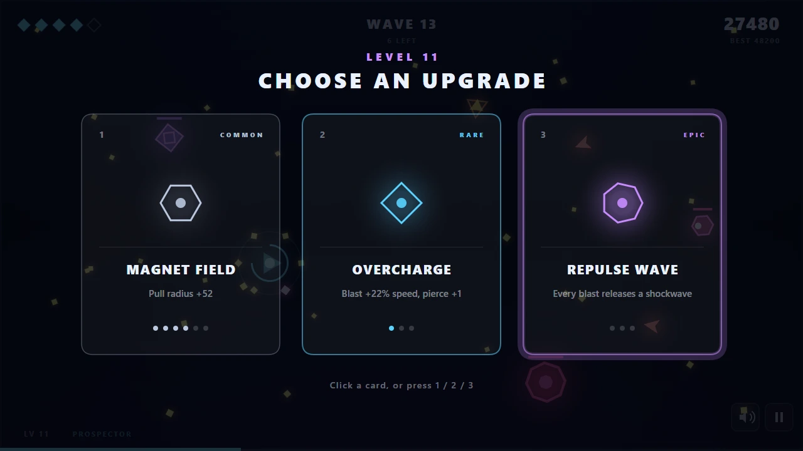
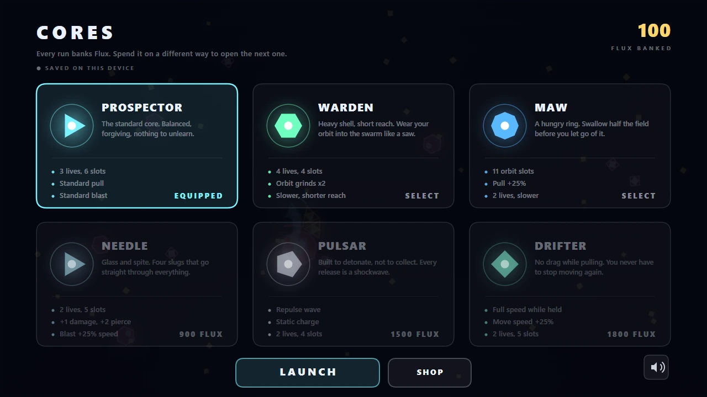
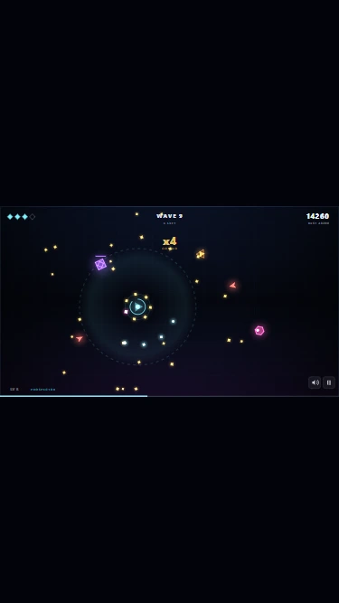

# Magnetar

[](#crazygames-submission-checklist)
[](#sdk-integration)
[](#magnetar)
[](#magnetar)
[](#magnetar)
[](LICENSE)

**Hold to pull, release to blast.** A one-button neon arena roguelite, built as a
single self-contained HTML file for CrazyGames.


<sub>The whole game in one motion. **Hold** — scrap spirals in and the orbit fills.
**Release** — all of it fires outward at once, seeking whatever is nearest. Wave 12,
2.4 seconds, no cuts.</sub>


<sub>All six enemy types at once. The yellow ring means the orbit is full. The dashed
diagonal is a lancer's aim telegraph — its spike is the one projectile you cannot
catch, which is what stops "hold forever" from being a free bullet shield.</sub>


<sub>A Guardian arrives every fifth wave. Its bursts are magnetic, so the bullet wall
it throws at you is also the ammunition you kill it with.</sub>

| Level up | Cores |
|---|---|
| [](docs/screenshot-levelup.webp) | [](docs/screenshot-cores.webp) |
| One card per tier. Colour, label, icon and the epic's bloom all carry the rarity, and the LEVEL header tints violet when an epic is in the hand. | All four states at once: **equipped**, owned, affordable, and locked. Filled pips and Flux costs read at a glance. |

| | |
|---|---|

### Portrait on a phone

| Letterboxed | With the rotate prompt |
|---|---|
|  |  |
| **The problem.** The arena is a fixed 16:9 field scaled to fit, so a 375×667 screen gets a 375×211 strip — **32% of the display**, with 228px of black above and below. Nothing breaks and the layout holds, but it is small. | **The fix.** Landscape gives the playfield the full width at roughly double the scale, so the game asks for it rather than letterboxing silently. Touch devices in portrait only — never on desktop, never over an ad — and always dismissable via **Play anyway**, since orientation can be locked at the OS level. |


```
dist/index.html    <- the submission build (standalone, no dependencies)
game-body.html     <- same game as an Artifact-shaped fragment
src/p1..p5.txt     <- source parts
build.mjs          <- concatenates src -> both builds (+ dist/test.html for QA)
```

Build with `node build.mjs`. There is no toolchain, no npm install, no assets.

Ready to publish: **[SUBMISSION.md](SUBMISSION.md)** holds the upload file, the
three cover images at CrazyGames' required sizes, and every form field written
out to paste.

---

## Why this game

Pulled from CrazyGames' own listings and developer docs rather than intuition:

- **`.io` arena games dominate the charts** — agar.io, paper-io-2, snake-io,
  holey-io, hexanaut-io, diep.io, cubes-2048-io. The shared shape is a single
  screen, one verb, bot-filled pressure, instant restart.
- **Short-session "one more run" arcade** (space-waves, final-drop) and
  **roguelite progression** are the other two high-traffic lanes.
- The docs are strict about friction: land in gameplay in **≤1 click**, onboard
  *inside* gameplay, stay readable from **800×450 to 1920×1080**, keep physics
  consistent at 144/165 Hz, don't bind Escape or Ctrl+W, don't force WASD
  (AZERTY keyboards), stay under 50 MB.

Magnetar sits in the intersection: arena survival with a roguelite upgrade loop,
built around one verb that works identically on mouse, touch, and keyboard.

**The hook:** the blast is radial, so there is nothing to aim. That means the
same control scheme is complete on every device — and it makes the signature
move legible in a thumbnail: *catch the enemy's bullets and fire them back.*

---

## How it plays

You are a magnetic core in a closed arena.

- **Hold** — pull scrap and enemy bolts into orbit around you. Orbiting objects
  grind enemies on contact. You move at 60% speed while holding.
- **Release** — everything in orbit fires outward as magnetically-guided slugs.
  Caught enemy bolts hit far harder than scrap.
- Clear waves, level up, pick 1 of 3 upgrades drawn by rarity from 12 options.
- Guardian boss every 5th wave.

**Controls** — Mouse: move to steer, hold button to pull. Touch: drag to steer,
lift to blast. Keyboard: arrows / WASD / ZQSD to move, Space or Shift to pull.
`M` mute, `P` pause, `1`/`2`/`3` pick an upgrade, `C` cores, `Enter` restart.

**Six enemy types**, each with a distinct silhouette and colour: drone, spinner,
shooter, splitter, brute, and lancer.


---

## Layout and spacing

Every screen is drawn on the canvas in a fixed 1280x720 virtual space, so
layout is arithmetic rather than CSS. A single spacing scale (`PAD`, `GAP`) and
a hairline `hr()` rule now do the grouping that cramped spacing used to.

Two real defects came out of this pass:

- **The XP bar ran underneath the mute and pause buttons.** It was an inset
  rounded bar at `VH-22` spanning to `VW-30`, while the buttons sat at
  `VH-58`, 42px tall — they overlapped for ~74px. XP is now a full-bleed 5px
  line along the very bottom edge and the buttons moved up clear of it.
- **The wave banner was dead code.** `waveBanner` and `waveBannerTxt` were set
  on every wave and decayed every frame but never drawn. It now fades in and
  out over the arena at wave start (and is gated to gameplay, so it cannot
  bleed through a menu).

Screen by screen: the top HUD row got a real baseline gap (40 / 66) instead of
30 / 52; the boss bar dropped clear of the wave label; level-up cards grew from
300x348 to 316x384 with a divider between icon and text; the game-over panel
went 520x452 to 580x512 and is now grouped by two hairlines into identity /
run detail / payout / actions, with the hint moved inside the panel; the core
menu's cards grew and its badges share a baseline with the last stat line.

Verified by geometry rather than by eye: no two hit rects overlap on any
screen, every rect sits inside the 1280x720 field, card margins are symmetric,
buttons stay inside their panels, and the banner band still fits at every
tested viewport. All eleven screen states render without throwing at 800x450,
1920x1080 and a 531x683 portrait ratio.

---

## Upgrade rarity

Three tiers, drawn by weight without replacement so a hand never repeats a card.

| Tier | Weight each | Upgrades | Character |
|---|---|---|---|
| Common | 56 | Magnet Field, Orbit Slots, Thrusters, Scavenger, Reinforced Hull | Incremental, always useful |
| Rare | 30 | Overcharge, Spin Cycle, Heavy Slugs, Siphon | Real power spikes |
| Epic | 12 | Repulse Wave, Static Charge, Ricochet | Behaviour-changing |

Measured over 4000 draws: **62% common, 29% rare, 9% epic**, with an epic in
**25% of level-ups**. That share rises naturally as commons max out, so late
runs deal better cards without any special-casing.

**Rarity has to mean power, or it is just decoration.** The epic tier is the
three upgrades that change how the game plays rather than scaling a number, and
two were buffed to earn the tier: Ricochet now grants two wall bounces per stack
instead of one, and Static Charge's lightning scales with stacks instead of
always dealing 1. Repulse Wave was already the strongest thing in the pool —
bot testing during the core rebalance had it carrying runs to wave 39 — so it
set the bar the others were raised to.

Visually each tier gets its own colour (steel / cyan / violet) on the border,
icon, glow and stack pips, plus a tier label on the card. Epics carry a pulsing
outer bloom, the LEVEL header tints violet when one is in the hand, and a
separate audio sting plays — you hear the good hand before you finish reading
it. Each upgrade also has a fixed icon shape now; previously the polygon came
from the card slot, so the same upgrade looked different every level.

### It changed the difficulty, so I corrected for it

Rarity is a presentation change, but weighting the draw toward commons made the
average level-up weaker than the old uniform draw over 12 cards. Bot runs went
from median wave 37 to median 20, and every run started ending in death.

Weights were moved from 62/28/10 to 56/30/12 and the commons buffed a little
(pull radius +52, move speed +15%, Reinforced Hull heals 2) so rarity changes
*which* cards you see rather than how strong you end up. Result over 15 runs
each:

| Picker | Median wave | Mean | Deaths |
|---|---|---|---|
| Before rarity | 37 | 34 | 7/15 |
| Random pick | 20 | 28 | 15/15 |
| Always take the rarest | 46 | 38 | 15/15 |

The gap between the two pickers is the point: recognising the good card is now
worth more than twice the depth. And unlike the pre-rarity build, no run
survives the six-minute cap — the immortal tail is gone. Median run for random
picking is 3.1 minutes.

The usual caveat applies: these are 15-run samples of a bimodal distribution, so
treat ±10 waves as noise. The 46-vs-20 gap is far outside that.

---

## Meta-progression

Every run banks **Flux** (`15 + score/150 + wave*4`), spent on **starting
cores** that rewrite the opening build. The core menu is reached from the death
screen, never before first play, so gameplay still starts in zero clicks.

| Core | Cost | Trade |
|---|---|---|
| Prospector | free | Baseline. 3 lives, 6 slots |
| Warden | 150 | 4 lives, orbit grinds x2 / 4 slots, shorter reach, slower |
| Maw | 450 | 11 slots, pull +25% / 2 lives, slower |
| Needle | 900 | +1 damage, +2 pierce, faster blast / 2 lives, 5 slots |
| Pulsar | 1500 | Repulse wave + static charge / 2 lives, 4 slots, short reach |
| Drifter | 1800 | No drag while pulling, +25% speed / 2 lives, 5 slots |

The equipped core retints the player, its field, and its slugs, and changes the
silhouette — so a run *looks* different, not just plays differently.

**Cores are sidegrades, not a power ladder.** First pass had Warden reaching
wave 44 against Prospector's 17: the cheapest unlock ended the meta, because
you would buy it once and never choose anything else. Every core now pays for
its strength in lives and orbit slots. Across 15 runs each, mean waves land in
a **23–35 band with the free Prospector at the top of it** — buying a core buys
variety, never an advantage, which also keeps the score chase honest.

Unlock pacing at a typical ~200 Flux/run: Warden run 1, Maw run 3, Needle run
8, Pulsar run 15, Drifter run 24. Saves are validated on read — a tampered or
corrupt `mgn.core` falls back to Prospector rather than granting a locked core.

---

## Two design problems that testing caught

Both were found by scripting bots against `update()` directly, simulating
thousands of minutes of play in seconds.

**1. Radial blasts missed, so waves stalled.** A competent bot survived 180
seconds *without taking a single hit* and still only reached wave 3 — the blast
sprayed six slugs in six directions and hit nothing. Fix: blasted objects curve
toward nearby enemies (`SHOT_SEEK` / `SHOT_TURN`). This fits the fiction —
magnetically guided ammunition — and keeps the no-aiming promise intact. Wave
times dropped from 30-50s to 4-14s.

**2. Holding the magnet made you immune to bullets.** Every ranged attack was
catchable, so a fully-upgraded player was untouchable — bots ran 10 minutes to
wave 79 and never died. Fix: the **lancer** fires a non-magnetic spike after a
0.85s telegraphed charge. It cannot be caught, only dodged, which breaks the
dominant "hold forever" strategy. Sustain was also capped to one heal per wave.

### Current balance

Latest sample is 15 bot runs per core, 90 runs total, capped at 6 minutes:

| | |
|---|---|
| Mean wave, across cores | 23–35 |
| Runs ending in death | roughly half within the 6-minute cap |
| Wave clear time | 4–14s (bosses 9–15s) |
| Typical Flux per run | ~200 |

Outcomes are strongly bimodal — a run either ends by wave 20 or snowballs — so
per-core medians swing by 20+ waves between samples of nine. Two passes read
Warden at 24 and then 43 with **identical config**. Treat single-digit samples
as noise; the 15-run means above are the trustworthy figure. Tuning lives in
`startWave` (`src/p2.txt`) and `ETYPE` / `UPGRADES` / `CORES`.

---

## CrazyGames submission checklist

Every box below was verified in this repo, most of them by scripted geometry or
bot runs rather than by eye. The badge counts these twelve, which are the
requirements CrazyGames documents.

- [x] **Gameplay in ≤1 click** — loads straight into a playable tutorial wave; no menu, no splash
- [x] **Onboarding inside gameplay** — 3-step scripted intro, visual not textual, auto-skipped for returning players
- [x] **Readable 800×450 → 1920×1080** — fixed 1280×720 virtual canvas, letterboxed scale-to-fit; all screens render at 800×450, 1920×1080 and 531×683
- [x] **Consistent physics at 144/165 Hz** — fixed 1/120s accumulator with a substep cap; no spiral-of-death
- [x] **No reserved keys** — Escape and Ctrl+W unbound
- [x] **International keyboards** — arrows + WASD + ZQSD; the blast is radial, so nothing needs rebinding
- [x] **Touch parity** — drag to move, lift to blast; identical verb on every device
- [x] **Download size** — 111 KB, one file, well under the 50 MB cap
- [x] **Zero external requests** — procedural art, WebAudio-synthesised music and SFX, no CDN, no assets
- [x] **Audio behaviour** — starts only after a user gesture, mute persists, pauses on blur/hidden, ducks for ads
- [x] **PEGI 12** — abstract neon shapes, no gore, no sexual content, no real-money gambling
- [x] **Original IP** — all code, art and audio generated for this game

### Ad and SDK rules

- [x] Midgame ad only on death, never during gameplay
- [x] Rewarded revive is clearly optional, clearly an ad, and carries a countdown
- [x] Reward granted only on `adFinished`, never on `adError`
- [x] No ad chaining — one ad opportunity per run
- [x] Game muted and paused on `adStarted`, restored on finish or error
- [x] Blocking spinner during the request; two timeouts so a silent SDK cannot freeze the game
- [x] Banners on menus only (death screen, core menu), never during play
- [x] Banner clear of the game's buttons; click-anywhere disabled while one is on screen
- [x] Playable with an adblocker — the revive button is hidden rather than dead
- [x] Basic launch — `adsDisabledBasicLaunch` / `bannersDisabledBasicLaunch` switch ads
  and banners off for the session on the first refusal, so the revive is never offered
  as a button that cannot work and no space is reserved for a slot that cannot fill
- [x] Portal muting — `SDK.game.settings.muteAudio` is honoured and followed via
  `addSettingsChangeListener`, and it overrides the in-game mute button rather than
  being toggleable by the player

### Beyond the requirements

Not documented requirements, but things QA and players notice.

- [x] **Mobile orientation** — portrait on a touch device prompts for landscape instead of silently letterboxing into a strip a third of the screen tall; dismissable, and never shown on desktop or over an ad

### Confirm on your first upload

These three cannot be exercised off-portal, so they are genuinely unverified:

- [ ] **A real ad creative renders** — there is no fill outside CrazyGames, so only the reserved slot and its ADVERTISEMENT label are proven, not an actual ad
- [ ] **Cloud save round-trip** — sign in on two devices and confirm Flux and unlocks follow you; the merge logic is unit-tested against a mock, but the real account hop is not
- [ ] **The ad-loading overlay's appearance** — its behaviour (blocks input, halts the sim) is tested; only how it looks is unconfirmed

Storage is exception-safe at every level — see **Cloud saves** below.

---

## Cloud saves

`store()` is one small key-value layer over three backends, preferred in order:

1. **CrazyGames SDK data module** — synced to the player's account and across
   their devices. Adopted at runtime once `SDK.init()` resolves.
2. **localStorage** — per-device; the default before and without the SDK.
3. **In-memory map** — private mode, sandboxed iframes, blocked storage.

Reads are cached, because the HUD asks for the best score every frame and an
SDK `getItem` per frame is pure waste. Every path is exception-safe: storage
that throws degrades to memory rather than breaking the run.

Synced keys: `mgn.earned`, `mgn.owned`, `mgn.core`, `mgn.best`, `mgn.bestwave`,
`mgn.played`. `mgn.mute` is deliberately **device-local** — muting your phone
on a bus should not mute your desktop.

### Flux is derived, not stored

The save holds **lifetime Flux earned** plus the owned set, and the balance is
computed as `earned − sum(cost of owned)`. Buying a core writes only the new
`owned` entry; nothing is ever deducted.

This exists because a stored balance cannot be merged safely. Taking the max of
two devices would hand back Flux already spent on an unlock, and taking the min
would destroy progress. It also means the balance can never drift out of step
with what you own. Old saves that stored a balance are migrated once on boot
(`migrateSave`).

### Merging never takes anything away

The SDK migrates its *own* guest data on sign-in, but guest progress written
straight to localStorage before the SDK loaded is invisible to it. `adoptCloudSave`
covers that gap by folding the local save into the cloud one:

| Field | Rule |
|---|---|
| `owned` | Union — an unlock is never revoked |
| `earned`, `best`, `bestwave` | Max — monotonic counters |
| `core` | Cloud's choice if owned after the merge, else local's, else Prospector |
| `played` | Set if either side has it |

A cloud value can land mid-session. Flux, unlocks and best scores are all read
live so they need nothing, but the equipped core is only consulted when a run is
built — so `applyCloudSave` re-rolls the player **only** while the run is still
untouched (intro, or wave 1 with no kills and no score). A run in progress keeps
the core it started with and picks up the cloud choice on the next launch.
Re-rolling someone's build at wave 20 would be theft.

### The environment gate is load-bearing

`SDK.environment` returns `local`, `crazygames`, or `disabled`. Testing against
the **real** SDK confirmed that on a `disabled` domain `SDK.data.getItem()`
throws `sdkDisabled` — so without the guard, every save read would throw on any
non-CrazyGames host (embeds, mirrors, local files) and persistence would break
outright. The adapter checks `environment` before touching any module.

Verified with a mock data module across 50 assertions: migration, derived
balance, guest→cloud upload, fresh-device download, divergent-device merge,
tampered core, disabled environment, a data module that throws on every call,
mid-run protection, and sign-in cache invalidation. Plus a live check against
the real SDK on a disabled domain.

---

## SDK integration

`ENABLE_CG_SDK` is **on** in `dist/index.html`. The build flips it off for
`game-body.html`, since the Artifact host's CSP blocks external scripts and
loading it there would only log a violation.

Already wired:

| Call | When |
|---|---|
| `data.*` | All persistence, via `store()` |
| `user.addAuthListener` | Drops the read cache and re-applies on sign-in |
| `game.gameplayStart` / `gameplayStop` | Run start and death |
| `game.loadingStart` / `loadingStop` | Bracketed once the SDK can hear us |
| `game.happytime` | Guardian kills and new best scores |
| `game.reportGameCompletedPercentage` | Each wave, against wave 30 as 100% |
| `ad.requestAd('rewarded')` | Optional revive, offered once per run |
| `ad.requestAd('midgame')` | On death, subject to the rules below |
| `ad.hasAdblock` | Hides the revive button when ads cannot run |
| `banner.requestBanner` / `clearBanner` | Death screen only |
| `game.settings.muteAudio` + `addSettingsChangeListener` | Portal-initiated muting |

### Ads

The end-of-run sequence is:

```
die  ->  [revive offer]  ->  finishRun  ->  [midgame ad]  ->  game over
```

**Rewarded revive.** Offered once per run, and only from wave 3 up — a run that
ended in ten seconds is not worth an ad. The screen states plainly that it is an
ad, that it is optional, and that declining costs nothing, and it carries the
countdown the docs ask for; it auto-declines after 8 seconds rather than
nagging. Reviving restores 2 lives, clears bolts and nearby enemies, and grants
3 seconds of invulnerability at the same wave with the same build.

The reward is granted **only** on `adFinished`. On `adError` the run simply
ends — no reward, and a short "no ad available" note so the player knows why.

**Midgame ad.** On death, an allowed placement. Skipped when the run was under
45 seconds, and skipped entirely if the player already engaged with the rewarded
offer that run — watched it *or* had it fail on them. The game-over panel waits
for the ad and appears on `adFinished` **and** on `adError`, because freezing
between an ad and the next screen is a listed rejection cause. The SDK enforces
its own 3-minute cap, so no interval tracking here.

**Payout moved out of `die()`.** Flux and best scores are banked in `finishRun`,
which is the true end of a run. Left in `die()`, a revived run would have paid
out twice — once at the first death and again at the second.

**Audio and pausing.** `A.duck()` is separate from the player's mute setting, so
restoring audio after an ad cannot clobber what they chose. The game mutes and
pauses on `adStarted` (not on request, per the docs) and restores on
`adFinished` or `adError`. A blocking overlay with a spinner covers the request
so nothing underneath is clickable.

**Two timeouts, because a game that hangs on an ad gets rejected.** If
`adStarted` never fires within 8 seconds the request is abandoned and the run
continues; if an ad starts but never reports back, a 120-second backstop
releases the player. Either way the panel appears.

**Adblock.** `hasAdblock()` is checked at init. If ads cannot run, the revive
button is never shown — a button that can never work is itself a rejection
cause — and the game plays exactly as it does off-portal.

Verified with a mock ad module: revive grant and denial, no reward on error,
no ad chaining, payout exactly once across a revive, mute preference surviving a
duck cycle, adblock suppression, click swallowing behind the overlay, and a live
8.6-second wait proving the start guard releases a request that never begins.
Then 8 bot runs with no SDK at all, confirming the ad-free path is unchanged.

**Banner.** Menus only - the death screen and the core menu, which the ad
requirements list as an allowed placement (a shop). Banners are forbidden
during gameplay, so `syncBanner` never shows one in play, intro or level-up,
and pulls it during a video ad.

The two screens park the band at different heights (582 on death, 600 on the
core menu), so moving between them clears and re-places rather than reusing the
old slot. The core menu has no spare band, so it **reflows** when a banner is
reserved: cards tighten from 225 to 186 tall and LAUNCH moves up from y650 to
y524, leaving a clear 120-unit band. With no ad - no SDK, no fill, the Artifact
build - the roomy layout is what you get.

The banner is real DOM, not canvas, so it needs its own element and its own
layout. Size is chosen from the space actually available under the panel:
728x90, 468x60 or 320x50, or nothing at all if the viewport is too short. The
panel shifts up from y112 to y76 when a banner has space, and that space is
**reserved as soon as we know a banner could fill** — so an unfilled ad
collapses the container without the panel jumping.

Two rules from the ad requirements shaped the code:

- *"Ensure your game's buttons are far away from the banner."* The death screen
  previously restarted on a click **anywhere**, which would have made the whole
  page a button sitting next to an ad. With a banner present, the pointer target
  is now the PLAY AGAIN button alone, and the hint text says so. Enter still
  works — a keypress cannot mis-hit an ad. Without a banner, click-anywhere is
  unchanged. Measured clearance: 56px below the button at 964x419.
- *"Banners must be clearly distinguishable from game content."* Hence the
  ADVERTISEMENT label above the slot.

The container is **revealed only once an ad has actually filled it**, never
during the request, so nobody sees an ADVERTISEMENT label over an empty box.
The space is still reserved immediately, so the layout does not jump.

`hide()` clears the banner, resets the cached size, and bumps a **request
token**. Two bugs made that necessary: moving death -> core menu while a
request was in flight left a labelled empty box (the in-flight guard skipped
the re-request), and a request that never settled wedged `requesting` true
forever, blocking every later banner for the session. The token also means a
late response for a screen you have already left can never reveal an emptied
container, and a stale rejection cannot clear a live request's flag or count
against the failure budget.

A request inside the SDK's refresh floor comes back `bannerCooldown`, which
collapses the slot and is not counted as a failure; three real failures stop
requests for the session.

Verified: hidden at boot and through 1200 frames of real gameplay, level-up,
intro and the core menu; shown only on death; correct size and no overflow
across nine viewports from 1920x1080 down to 375x667 and the 800x450 minimum;
cleared on leaving; unfilled collapses without moving the panel; rapid
re-death re-requests rather than showing an empty box; give-up after three
failures restores the normal layout.

Still worth adding before launch:

- **A non-ad way to earn Flux.** The requirements ask that rewards be
  obtainable without ads; Flux already is (every run pays out), so keep that
  true if a rewarded Flux bonus is ever added.

---

## License

[PolyForm Strict 1.0.0](LICENSE) — © 2026 Akic2. Source-available, not open source.

The source is here to be **read**. The licence does not grant permission to
use, modify, or redistribute it: no forks, no derivative games, no publishing
a build anywhere. Noncommercial personal use — running it locally, studying
how it works — is permitted; anything beyond that is not.

Copyright and trademark are separate, and the name *Magnetar* is not part of
any grant either.

**This is not retroactive.** Earlier commits published this project under MIT,
and MIT is irrevocable for the versions it covered. Anyone who obtained the
code during that window keeps MIT rights *to that version* permanently. This
licence governs the current and future state of the repository. The MIT window
was short and the repository had just gone public, so the practical exposure
is small — but it is not zero, and rewriting history would not change it,
because a granted licence cannot be withdrawn by deleting the commit.

If you want to do something the licence does not allow, ask.
